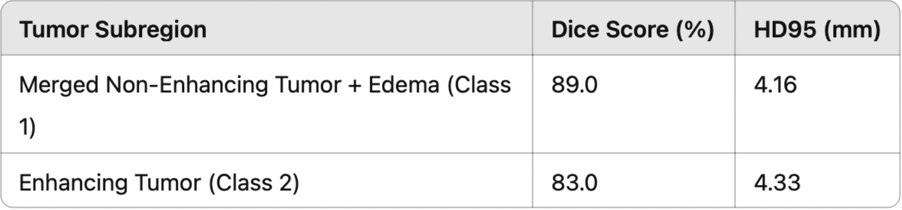
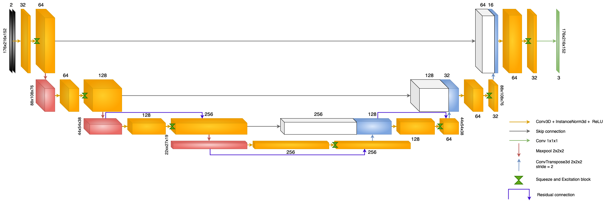
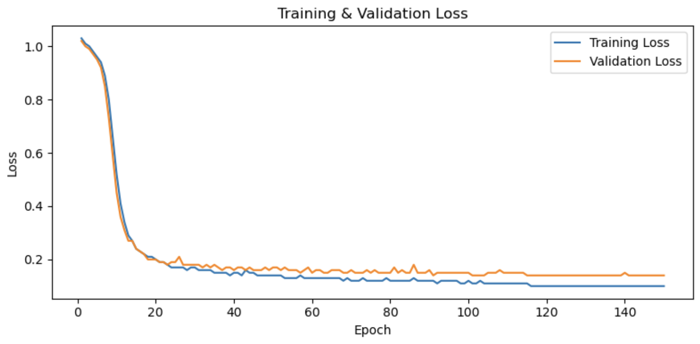
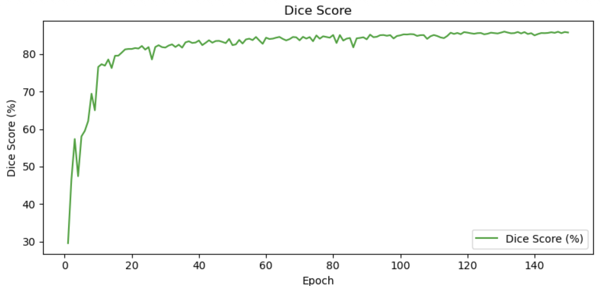
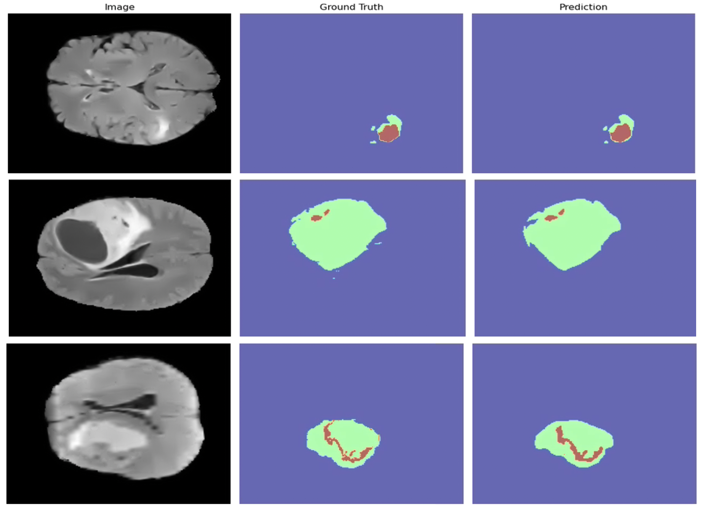

# Brain Glioma Segmentation — Residual-SE U-Net (3D, Multi-Modal MRI)

[](LICENSE)
[](https://www.python.org/downloads/)
[](https://pytorch.org/)

Fully automated 3D segmentation of brain gliomas from multi-modal MRI, using a
U-Net augmented with residual connections and Squeeze-and-Excitation blocks.
Trained on BraTS 2021 with FLAIR and T1ce modalities under single-GPU memory
constraints.



## Overview

Gliomas are the most common primary brain tumour. The BraTS dataset annotates
three nested sub-regions: **enhancing tumour (ET)**, **tumour core (TC)**, and
**whole tumour (WT)**. Manual delineation is slow and subject to inter-rater
variability. This project implements an end-to-end 3D deep-learning pipeline
that segments gliomas from preprocessed MRI volumes, with a focus on the
engineering trade-offs required to train a 3D U-Net on a single consumer GPU.

## Motivation

- Reproduce a competitive BraTS segmentation pipeline end-to-end in PyTorch.
- Explore the engineering trade-offs (mixed precision, gradient checkpointing,
  gradient accumulation) required to train 3D U-Nets on a single consumer GPU.
- Quantify the cost of restricting input to two modalities (FLAIR + T1ce)
  versus the full four-modality BraTS protocol.

## Architecture

A 3D U-Net with:

- **Residual + Squeeze-and-Excitation blocks** at every encoder/decoder stage
  for stable gradient flow and channel-wise feature recalibration.
- **Instance normalization** (preferred over BatchNorm for batch size 1).
- **MaxPool** for downsampling and **transposed convolution** for upsampling
  via skip connections.
- **Adaptive dropout** that scales with network depth.
- **Gradient checkpointing** on deeper encoder, bottleneck, and decoder
  stages to bound peak VRAM.

See [`docs/METHODOLOGY.md`](docs/METHODOLOGY.md) for the long-form description.



| | Value |
|---|---|
| Input | 2 channels (FLAIR, T1ce), full cropped volume |
| Output | 3 classes (background, merged non-enhancing+edema, enhancing) |
| Encoder depth | 3 stages + bottleneck (32 → 64 → 128 → 256) |
| Loss | Generalized Dice + Focal |
| Normalization | Instance |

## Preprocessing pipeline

1. Load BraTS 2021 NIfTI volumes (FLAIR, T1ce, segmentation).
2. Compute global non-zero crop bounds across the dataset; round to a multiple
   of 8 to match the U-Net's three pooling stages.
3. Per-modality **z-score normalization** using statistics computed from
   non-zero voxels across the whole dataset.
4. Refine BraTS labels: `{1, 2} → 1` (non-enhancing + edema merged),
   `{4} → 2` (enhancing tumour).
5. Augmentation (training only, via MONAI): random flips, 90° rotations, slight
   affine, intensity scale/shift, Gaussian noise, bias-field simulation.

## Training setup

| | |
|---|---|
| Hardware | 1× NVIDIA RTX A4000 (16 GB VRAM) |
| Framework | PyTorch 2.1 + MONAI 1.3 |
| Optimizer | AdamW, lr 1e-4 |
| Scheduler | `ReduceLROnPlateau` (patience 12, factor 0.5) |
| Loss | Generalized Dice + Focal |
| Batch | 1 (effective 8 via gradient accumulation) |
| Precision | Mixed (`torch.amp.autocast` + `GradScaler`) |
| Memory | Gradient checkpointing on encoder stages 2–3, bottleneck, decoder stages 2–3 |
| Dropout | 0.15, scaled ×1.25 per depth level |
| Epochs | 150 |
| Split | 80 / 10 / 10 train / val / test (by sorted subject index) |

## Results

Held-out test set (10% of BraTS 2021).

| Class | Dice ↑ | HD95 (mm) ↓ |
|---|---|---|
| Non-enhancing + edema (merged) | **0.89** | **4.16** |
| Enhancing tumour | **0.83** | **4.33** |

**Important caveats.**

- Class definitions differ from the standard BraTS ET / TC / WT regions; the
  numbers above are **not directly comparable** to BraTS leaderboard entries.
- Evaluation is on a local 10% hold-out split, not the official BraTS
  validation server.
- Only two modalities (FLAIR + T1ce) were used; the full four-modality protocol
  is expected to improve enhancing-tumour Dice in particular.




## Qualitative results

Axial mid-slice of three test subjects, FLAIR vs. ground truth vs. prediction.



## Installation

```bash
git clone https://github.com/erfanzarenia/glioma-segmentation-3d.git
cd glioma-segmentation-3d
python -m venv .venv && source .venv/bin/activate
pip install -e ".[dev]"
```

## Usage

**Data.** BraTS 2021 must be requested from the
[official source](http://www.braintumorsegmentation.org/); it cannot be
redistributed. Place it at `data/raw/BraTS2021/`.

**Preprocess**

```bash
python scripts/preprocess.py \
    raw_dir=data/raw/BraTS2021 \
    processed_dir=data/processed
```

**Train**

```bash
python scripts/train.py
# override any config from CLI
python scripts/train.py training.epochs=200 model.dropout_rate=0.1
```

**Evaluate a checkpoint**

```bash
python scripts/evaluate.py checkpoint=runs/best.pt
```

## Repository layout

```
glioma-segmentation-3d/
├── configs/              # Hydra configs (model, data, training, inference)
├── src/glioma_seg/       # Importable package
│   ├── data/             # Dataset, transforms, preprocessing, I/O
│   ├── models/           # ReSE-UNet3D and building blocks
│   ├── training/         # Trainer, data manager
│   ├── inference/        # Evaluator
│   └── utils/            # Visualization, seeding, logging
├── scripts/              # Thin CLI entry points (preprocess, train, evaluate)
├── tests/                # Unit tests (shape / forward-pass)
├── assets/               # Figures used in README
└── docs/                 # Methodology, experiment notes
```

## Future improvements

- Re-evaluate against the standard BraTS ET / TC / WT regions for comparability.
- Comparison against the **nnU-Net** baseline.
- Sliding-window inference and test-time augmentation.
- Train with all four modalities (T1, T1ce, T2, FLAIR).
- Connected-component post-processing for fragmented enhancing-tumour predictions.
- Lightweight Gradio demo + Hugging Face Space.

## Citation

If you reference this code, please cite:

```bibtex
@misc{zarenia2025glioma,
  author = {Zarenia, Erfan},
  title  = {Residual-SE U-Net for 3D Brain Glioma Segmentation},
  year   = {2025},
  howpublished = {\url{https://github.com/erfanzarenia/glioma-segmentation-3d}}
}
```

Underlying dataset:

```bibtex
@misc{baid2021rsna,
  author = {Baid, Ujjwal and others},
  title  = {The RSNA-ASNR-MICCAI BraTS 2021 Benchmark on Brain Tumor
            Segmentation and Radiogenomic Classification},
  year   = {2021},
  eprint = {2107.02314},
  archivePrefix = {arXiv}
}
```

## Acknowledgements

- The [MONAI](https://monai.io/) project for medical-imaging primitives.
- BraTS 2021 organizers and data contributors.
- Supervisor: Dr. J. Bruce Morton, Western University.

## License

MIT — see [LICENSE](LICENSE).
